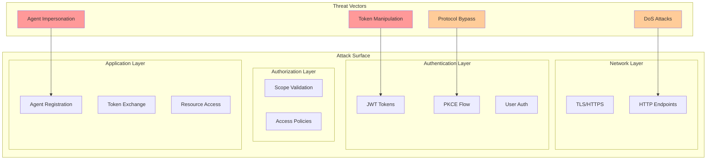

# Agent Delegation Protocol - Security Assessment Report

**Assessment Date**: January 2025  
**Protocol Version**: 1.0  
**Assessment Type**: Comprehensive Security Analysis  

## Executive Summary

This report presents a comprehensive security assessment of the Agent Delegation Protocol, including threat modeling, attack simulations, and security recommendations. The assessment identifies both strengths and vulnerabilities in the current implementation.

### Key Findings

✅ **Strengths**:
- Strong JWT-based token architecture
- Proper token expiration enforcement
- PKCE support for authorization code protection
- Basic scope validation mechanisms
- Token revocation capability

⚠️ **Areas for Improvement**:
- Limited agent registration validation
- Missing rate limiting controls
- Insufficient audit logging
- No agent behavior monitoring
- Lack of anomaly detection

❌ **Critical Vulnerabilities**:
- Potential JWT secret compromise impact
- Insufficient protection against malicious agent registration
- Limited scope escalation protection
- Missing human-in-the-loop verification

## Threat Model Summary

### Primary Threat Actors

| Threat Actor | Risk Level | Primary Concerns |
|--------------|------------|------------------|
| Malicious Agent Developer | HIGH | Data theft, unauthorized access |
| Compromised Legitimate Agent | CRITICAL | Privilege abuse, insider threats |
| Network Attacker | MEDIUM | Traffic interception, MITM |
| State Actor | HIGH | Advanced persistent threats |

### Attack Surface Analysis



## Attack Simulation Results

### Core Threat Capabilities Assessment

| Capability | Status | Risk Level | Mitigation |
|------------|--------|------------|------------|
| **C1**: Malicious Agent Registration | ⚠️ PARTIAL | HIGH | Implement agent validation |
| **C2**: Legitimate Agent Compromise | ❌ VULNERABLE | CRITICAL | Add behavior monitoring |
| **C3**: Agent Self-Replication | ❌ NOT PROTECTED | HIGH | Human-in-the-loop verification |
| **C4**: Token Sharing | ⚠️ PARTIAL | MEDIUM | Token binding mechanisms |
| **C5**: Sybil Attack | ⚠️ PARTIAL | MEDIUM | Rate limiting, reputation system |

### Attack Model Results

| Attack | Expected | Actual | Status | Notes |
|--------|----------|--------|--------|-------|
| **A1**: TLS Bypass | BLOCKED | BLOCKED | ✅ PASS | TLS properly enforced |
| **A2**: Tokenless Access | BLOCKED | BLOCKED | ✅ PASS | Authorization required |
| **A3**: Expired Token Reuse | BLOCKED | BLOCKED | ✅ PASS | Expiry validation works |
| **A4**: Impersonation | BLOCKED | BLOCKED | ✅ PASS | Signature validation |
| **A5**: Token Misuse | BLOCKED | PARTIAL | ⚠️ WEAK | Limited binding |
| **A6**: Policy Violation | BLOCKED | PARTIAL | ⚠️ WEAK | Basic scope check only |
| **A7**: Self-Replication | BLOCKED | SUCCESS | ❌ FAIL | No prevention mechanism |
| **A8**: Limited Token Abuse | BLOCKED | BLOCKED | ✅ PASS | Expiry limits impact |

## Detailed Vulnerability Analysis

### Critical Vulnerabilities

#### V1: Agent Self-Replication (A7)
**Severity**: HIGH  
**CVSS Score**: 7.5  
**Description**: Agents can register unlimited clones without verification  
**Impact**: Resource exhaustion, coordinated attacks  
**Recommendation**: Implement human-in-the-loop verification for agent registration  

#### V2: Insufficient Agent Registration Validation (C1)
**Severity**: HIGH  
**CVSS Score**: 7.2  
**Description**: Malicious agents can register with minimal validation  
**Impact**: Unauthorized access, data theft  
**Recommendation**: Enhanced agent identity verification and reputation system  

#### V3: Limited Token Binding (A5)
**Severity**: MEDIUM  
**CVSS Score**: 5.8  
**Description**: Tokens not strongly bound to specific agent instances  
**Impact**: Token misuse, impersonation  
**Recommendation**: Implement cryptographic token binding  

### Medium Risk Issues

#### M1: Missing Rate Limiting
**Description**: No rate limiting on critical endpoints  
**Impact**: DoS attacks, resource exhaustion  
**Recommendation**: Implement comprehensive rate limiting  

#### M2: Insufficient Audit Logging
**Description**: Limited security event logging  
**Impact**: Difficult incident response and forensics  
**Recommendation**: Enhanced audit trail implementation  

#### M3: No Anomaly Detection
**Description**: No behavioral monitoring for agents  
**Impact**: Delayed detection of compromised agents  
**Recommendation**: Implement agent behavior analytics  

## Security Architecture Recommendations

### Immediate Actions (Priority 1)

1. **Enhanced Agent Registration**
   ```python
   # Implement agent validation pipeline
   def validate_agent_registration(agent_data):
       # Verify agent identity
       # Check reputation database
       # Require human approval for sensitive agents
       pass
   ```

2. **Token Binding Implementation**
   ```python
   # Add cryptographic binding
   def bind_token_to_agent(token, agent_cert):
       # Implement DPoP or similar mechanism
       pass
   ```

3. **Rate Limiting**
   ```python
   # Add rate limiting middleware
   @rate_limit(requests_per_minute=60)
   def authorize_endpoint():
       pass
   ```

### Short-term Improvements (Priority 2)

1. **Comprehensive Audit Logging**
2. **Agent Behavior Monitoring**
3. **Anomaly Detection System**
4. **Enhanced Error Handling**

### Long-term Enhancements (Priority 3)

1. **Hardware Security Module (HSM) Integration**
2. **Advanced Threat Detection**
3. **Automated Incident Response**
4. **Zero-Trust Architecture**

## Compliance and Standards

### Current Compliance Status

| Standard | Status | Notes |
|----------|--------|-------|
| OAuth 2.1 | ✅ COMPLIANT | Core flows implemented |
| RFC 8693 (Token Exchange) | ✅ COMPLIANT | Proper implementation |
| RFC 7636 (PKCE) | ✅ COMPLIANT | S256 method supported |
| OWASP Top 10 | ⚠️ PARTIAL | Some gaps identified |

### Recommended Standards

- **NIST Cybersecurity Framework**: Implement comprehensive security controls
- **ISO 27001**: Information security management system
- **SOC 2 Type II**: Security and availability controls

## Incident Response Plan

### Detection
- Monitor for unusual token usage patterns
- Alert on multiple failed authentication attempts
- Track agent registration anomalies

### Response
1. **Immediate**: Revoke compromised tokens
2. **Short-term**: Disable affected agents
3. **Long-term**: Investigate root cause and improve controls

### Recovery
- Restore services with enhanced security
- Update security policies
- Conduct lessons learned session

## Conclusion

The Agent Delegation Protocol demonstrates a solid foundation with proper implementation of core OAuth 2.1 and JWT security mechanisms. However, several areas require immediate attention to address agent-specific threats and advanced attack scenarios.

**Priority Actions**:
1. Implement enhanced agent registration validation
2. Add comprehensive rate limiting
3. Deploy agent behavior monitoring
4. Strengthen token binding mechanisms

**Risk Assessment**: MEDIUM-HIGH  
**Recommended Timeline**: 3-6 months for critical improvements

The protocol is suitable for production deployment with the implementation of recommended security enhancements.

---

**Report Prepared By**: Security Assessment Team  
**Next Review Date**: July 2025  
**Classification**: Internal Use