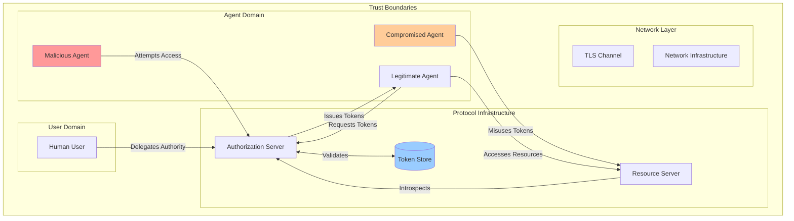
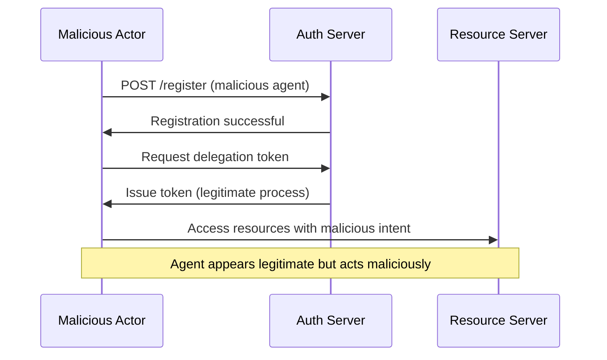
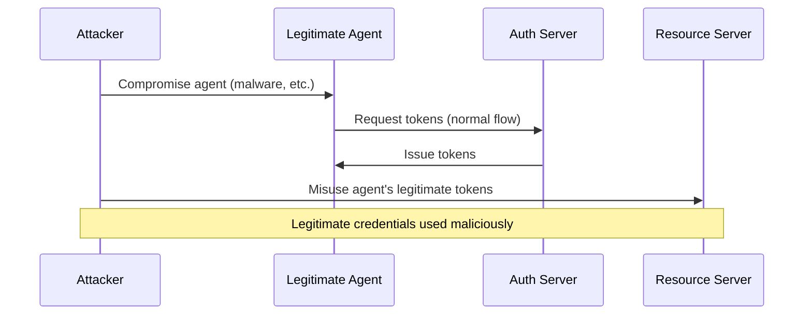
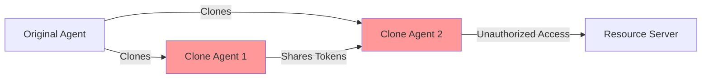
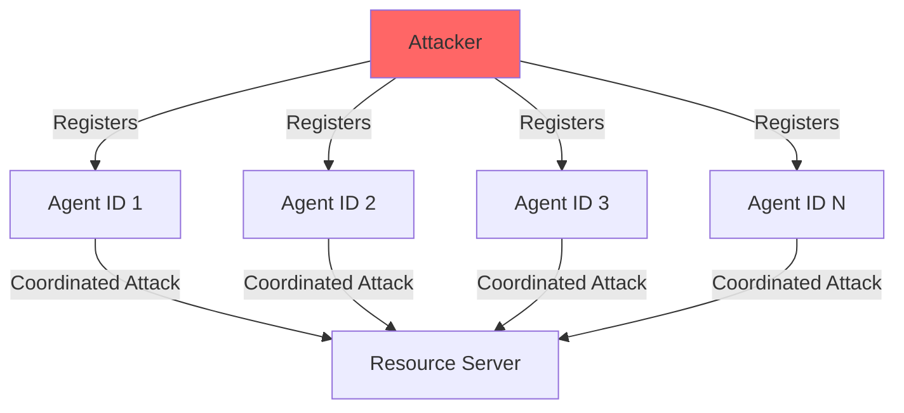

# Agent Delegation Protocol - Threat Model

## Executive Summary

This document provides a comprehensive threat model for the Agent Delegation Protocol, analyzing potential attack vectors, threat actors, and security controls. The analysis follows the STRIDE methodology and includes specific attack scenarios relevant to AI agent delegation systems.

## System Architecture Overview

## Threat Actors

### Primary Threat Actors

| Actor | Motivation | Capabilities | Access Level |
|-------|------------|--------------|--------------|
| **Malicious Agent Developer** | Financial gain, data theft | Code injection, social engineering | External |
| **Compromised Agent** | Varies (controlled by attacker) | Legitimate credentials, insider access | Internal |
| **Network Attacker** | Surveillance, data interception | Traffic analysis, MITM | Network |
| **Insider Threat** | Sabotage, data theft | System access, credential access | Internal |
| **State Actor** | Espionage, disruption | Advanced persistent threats | External/Internal |

### Secondary Threat Actors

| Actor | Motivation | Capabilities | Access Level |
|-------|------------|--------------|--------------|
| **Script Kiddie** | Recognition, chaos | Automated tools, public exploits | External |
| **Competitor** | Business advantage | Corporate espionage | External |
| **Disgruntled Employee** | Revenge, financial gain | Insider knowledge, access | Internal |

## Core Threat Capabilities (C1-C8)

### C1: Malicious Agent Registration
**Description**: Adversaries create and register malicious agents under their own identity.

**Risk Level**: HIGH
**Likelihood**: HIGH
**Impact**: Data theft, system compromise

### C2: Legitimate Agent Compromise
**Description**: A legitimate agent is compromised and misused by an adversary.

**Risk Level**: CRITICAL
**Likelihood**: MEDIUM
**Impact**: Privilege escalation, data breach

### C3: Agent Self-Replication
**Description**: Agents replicate themselves without registering with the Provider.

**Risk Level**: HIGH
**Likelihood**: MEDIUM
**Impact**: Token abuse, resource exhaustion

### C4: Token Sharing Between Agents
**Description**: One adversarial agent shares keys/tokens with another to impersonate or contact benign agents.

**Risk Level**: HIGH
**Likelihood**: MEDIUM
**Impact**: Identity confusion, unauthorized access

### C5: Sybil Attack
**Description**: Adversary conducts a Sybil attack by registering multiple agent identities.

**Risk Level**: MEDIUM
**Likelihood**: HIGH
**Impact**: Resource exhaustion, rate limit bypass

## Attack Models (A1-A8)

### A1: TLS Authentication Bypass
**Attack Vector**: Malicious agent tries to contact a legitimate one without valid TLS certs
**Expected Outcome**: TLS handshake fails
**Mitigation Status**: ✅ MITIGATED (TLS enforcement)

### A2: Tokenless Access
**Attack Vector**: Agent initiates communication without presenting a valid OTK or access token
**Expected Outcome**: Access denied
**Mitigation Status**: ✅ MITIGATED (Token validation)

### A3: Expired Token Reuse
**Attack Vector**: Malicious agent uses expired or overused access tokens
**Expected Outcome**: Detected and connection closed
**Mitigation Status**: ✅ MITIGATED (Token expiry validation)

### A4: Impersonation with Public Metadata
**Attack Vector**: Replays provider-issued signature of another agent to impersonate
**Expected Outcome**: Verification fails
**Mitigation Status**: ✅ MITIGATED (JWT signature validation)

### A5: Token Misuse (Wrong Agent)
**Attack Vector**: Reuses a valid token issued to a different agent
**Expected Outcome**: Identity mismatch leads to rejection
**Mitigation Status**: ✅ MITIGATED (Actor claim validation)

### A6: Contact Policy Violation
**Attack Vector**: Tries to communicate despite not being in the receiving agent's allowlist
**Expected Outcome**: Blocked by Provider
**Mitigation Status**: ⚠️ PARTIAL (Basic scope validation)

### A7: Self-Replication Registration
**Attack Vector**: Attempts to auto-register clones
**Expected Outcome**: Blocked by human-in-the-loop verification
**Mitigation Status**: ❌ NOT IMPLEMENTED

### A8: Limited Abuse with Valid Token
**Attack Vector**: Adversary uses a valid token, but impact is limited by expiry and quota
**Expected Outcome**: Limited damage due to controls
**Mitigation Status**: ✅ MITIGATED (Token expiry, scope limits)

## Advanced Attack Scenarios

### AS1: JWT Secret Compromise
**Description**: Attacker gains access to JWT signing secret
**Impact**: Complete protocol compromise
**Likelihood**: LOW
**Severity**: CRITICAL

### AS2: Time-based Attacks
**Description**: Exploiting clock skew or time validation weaknesses
**Impact**: Token replay, extended validity
**Likelihood**: MEDIUM
**Severity**: MEDIUM

### AS3: Scope Escalation
**Description**: Manipulating scope claims to gain elevated privileges
**Impact**: Unauthorized resource access
**Likelihood**: MEDIUM
**Severity**: HIGH

### AS4: PKCE Bypass
**Description**: Circumventing PKCE protection mechanisms
**Impact**: Authorization code interception
**Likelihood**: LOW
**Severity**: HIGH

### AS5: Resource Server Impersonation
**Description**: Malicious server impersonating legitimate resource server
**Impact**: Data theft, credential harvesting
**Likelihood**: MEDIUM
**Severity**: HIGH

## Risk Assessment Matrix

| Attack Scenario | Likelihood | Impact | Risk Level | Priority |
|-----------------|------------|---------|------------|----------|
| JWT Secret Compromise | LOW | CRITICAL | HIGH | P1 |
| Agent Compromise | MEDIUM | CRITICAL | HIGH | P1 |
| Malicious Agent Registration | HIGH | HIGH | HIGH | P1 |
| Scope Escalation | MEDIUM | HIGH | MEDIUM | P2 |
| Sybil Attack | HIGH | MEDIUM | MEDIUM | P2 |
| PKCE Bypass | LOW | HIGH | MEDIUM | P2 |
| Time-based Attacks | MEDIUM | MEDIUM | LOW | P3 |
| Resource Server Impersonation | MEDIUM | HIGH | MEDIUM | P2 |

## Security Controls Assessment

### Implemented Controls ✅
- JWT token signing and validation
- Token expiration enforcement
- PKCE support for authorization code protection
- Basic scope validation
- Token revocation capability
- TLS transport security (recommended)

### Partially Implemented Controls ⚠️
- Agent registration validation (basic)
- Rate limiting (not implemented)
- Audit logging (basic)
- Input validation (basic)

### Missing Controls ❌
- Agent behavior monitoring
- Anomaly detection
- Advanced rate limiting
- Token binding mechanisms
- Comprehensive audit trails
- Agent reputation system
- Human-in-the-loop verification for sensitive operations

## Recommendations

### Immediate Actions (P1)
1. Implement robust JWT secret management and rotation
2. Add comprehensive agent registration validation
3. Implement agent behavior monitoring
4. Add advanced rate limiting and DDoS protection

### Short-term Actions (P2)
1. Implement token binding mechanisms
2. Add comprehensive audit logging
3. Develop agent reputation system
4. Implement anomaly detection

### Long-term Actions (P3)
1. Add human-in-the-loop verification for sensitive operations
2. Implement advanced threat detection
3. Add support for hardware security modules (HSM)
4. Develop incident response automation

## Conclusion

The Agent Delegation Protocol implements solid foundational security controls but requires additional protections against advanced threats. The primary risks stem from malicious agent registration and potential agent compromise scenarios. Implementation of the recommended security controls will significantly improve the protocol's security posture.