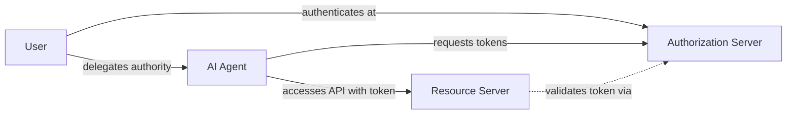
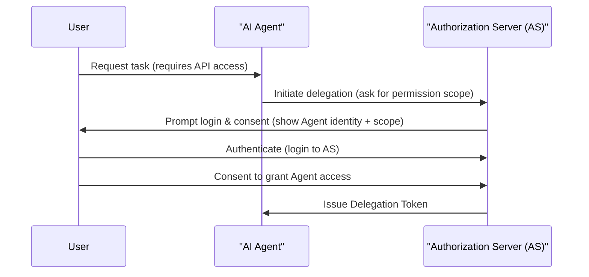
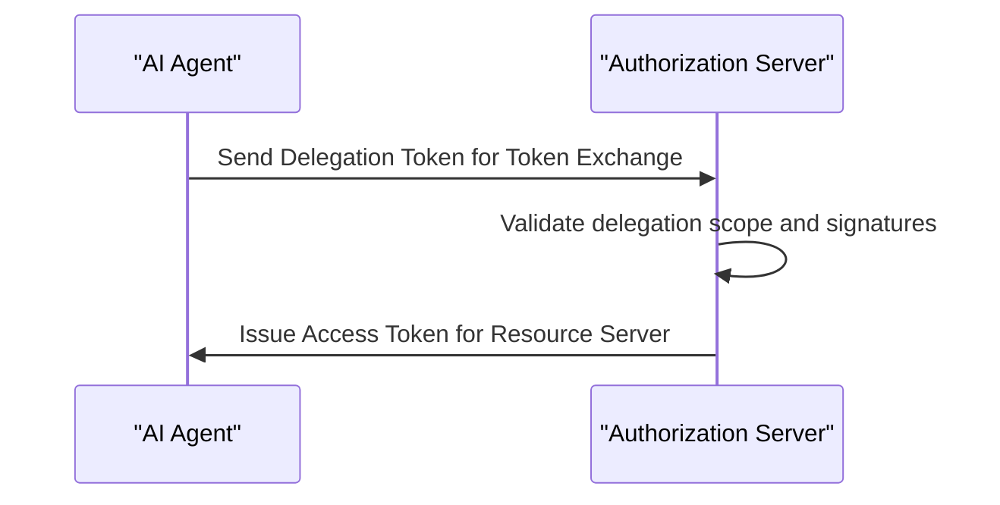
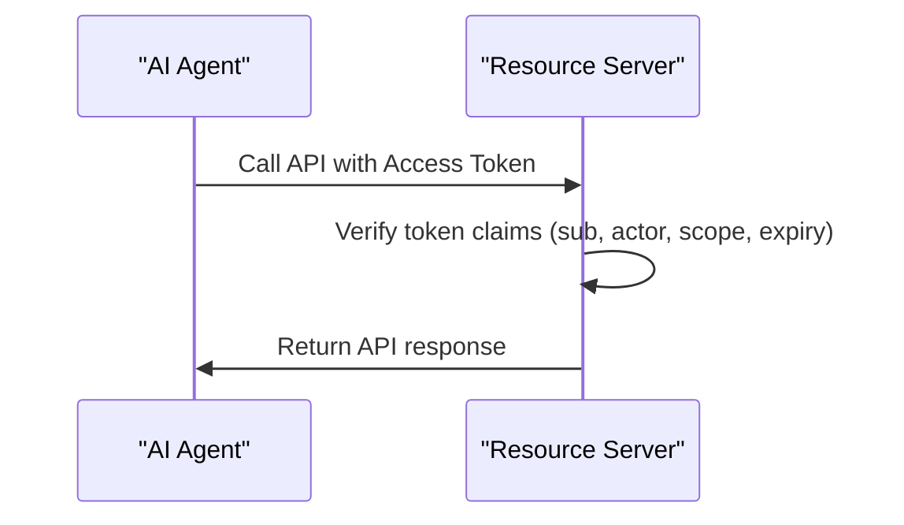
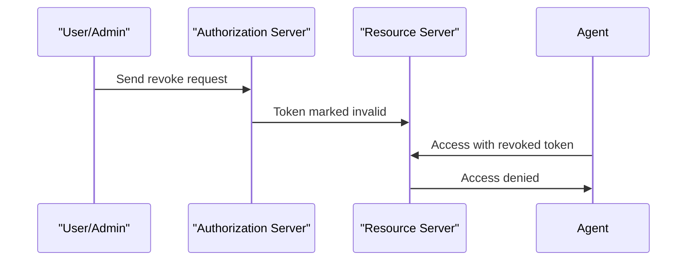

# Agent Delegation Protocol

This repository implements a complete prototype of the **Agent Delegation Protocol** inspired by the paper _"Authenticated Delegation and Authorized AI Agents"_.

It demonstrates how to securely delegate authority from a human user to an AI agent using standard OAuth2-like patterns, JWT tokens, and Python-based microservices.

## 🧩 Components

- **Authorization Server (`auth_server.py`)**
  - Issues signed delegation tokens to AI agents on behalf of users.
  - Exposes token exchange and revocation endpoints.

- **Resource Server (`resource_server.py`)**
  - Validates access tokens and enforces scope- and identity-based access.

- **AI Agent (`ai_agent.py`)**
  - Simulates a delegated agent requesting access and consuming a protected resource.

## 🔧 Prerequisites

- Python 3.8+

Install required packages:
```bash
pip install Flask PyJWT requests
```

## 🚀 Running the System

Start each service in its own terminal:

### 1. Authorization Server
```bash
python auth_server.py
```

### 2. Resource Server
```bash
python resource_server.py
```

### 3. AI Agent (Client)
```bash
python ai_agent.py
```

## ✅ Expected Flow

- The AI agent requests a **delegation token** for a user (`alice`).
- It exchanges the delegation token for a signed **access token**.
- It then uses the access token to call a protected endpoint on the Resource Server.

## 🔒 Security Features

- Delegation token includes `user`, `agent`, `scope`, and `exp` (expiry).
- Access token includes both `sub` (user) and `actor` (agent).
- Token introspection and revocation endpoints included.

## 🔁 Revocation
To revoke an access token:
```bash
curl -X POST -d "token=<access_token>" http://localhost:5000/revoke
```
Subsequent attempts to use the token will be rejected.

## 📂 File Structure
```
.
├── auth_server.py         # Authorization + Delegation Token Issuer
├── resource_server.py     # Validates tokens and protects resources
├── ai_agent.py            # Client agent simulation
├── README.md              # This file
```

## 📖 Examples
Usage examples live in the `examples/` directory:
- `langchain_espo_agent.py` – demonstrates a LangChain agent calling an API.
- `okta_integration.md` – walkthrough for integrating the protocol with Okta.
- `keycloak_integration.md` – example Keycloak setup with a GitHub Actions workflow.
=======


## 🧪 Extensions & TODO
- [ ] Add refresh token support
- [ ] Add UI for user consent
- [ ] Integrate PKCE & Proof-of-Possession (DPoP)

## 📚 Reference
- [Authenticated Delegation and Authorized AI Agents (arXiv)](https://arxiv.org/abs/2501.09674)
- [OAuth 2.0 Token Exchange (RFC 8693)](https://tools.ietf.org/html/rfc8693)


## 🔧Protocal Specification

# Agent Delegation Protocol 

_This specification defines a secure, standards-compliant, and implementable method for delegating authority from a human user to an AI agent using OAuth 2.1, OpenID Connect, and JWT._

---

## Table of Contents
- [Overview](#overview)
- [Roles and Responsibilities](#roles-and-responsibilities)
- [Protocol Flows](#protocol-flows)
  - [1. High-Level Architecture](#1-high-level-architecture)
  - [2. Delegation Flow](#2-delegation-flow)
  - [3. Token Exchange Flow](#3-token-exchange-flow)
  - [4. Resource Access Flow](#4-resource-access-flow)
  - [5. Revocation Flow](#5-revocation-flow)
- [Token Types and Claims](#token-types-and-claims)
- [Scope and Permission Design](#scope-and-permission-design)
- [Security Considerations](#security-considerations)
- [Python Implementation Guide](#python-implementation-guide)

---

## Overview

The Agent Delegation Protocol enables secure delegation of limited authority from a human user to an autonomous AI agent. It is built on existing standards like OAuth 2.1 and OpenID Connect, enabling straightforward implementation using JWTs, token exchange, and scope enforcement.

## Roles and Responsibilities

| Role             | Responsibility                                                                 |
|------------------|-------------------------------------------------------------------------------|
| User             | Human delegator who authorizes an AI agent to perform actions on their behalf |
| AI Agent         | Software agent acting on behalf of the user with restricted authority         |
| Authorization Server (AS) | Issues tokens, manages delegation, revocation, and token validation       |
| Resource Server (RS) | Hosts protected APIs and enforces access control based on verified tokens     |

---

## Protocol Flows

### 1. High-Level Architecture


### 2. Delegation Flow


### 3. Token Exchange Flow


### 4. Resource Access Flow


### 5. Revocation Flow


---

## Token Types and Claims

### 1. **Delegation Token (JWT)**
| Claim         | Description                                |
|---------------|--------------------------------------------|
| `iss`         | Authorization server issuer                |
| `sub`         | Agent ID                                   |
| `delegator`   | User ID (who granted permission)           |
| `scope`       | Array of approved permissions              |
| `exp`, `iat`  | Expiry and issued-at timestamps            |

### 2. **Access Token (JWT)**
| Claim         | Description                                |
|---------------|--------------------------------------------|
| `sub`         | User ID                                    |
| `actor`       | Agent ID                                   |
| `scope`       | Delegated permissions                      |
| `aud`         | Audience (Resource Server)                 |
| `exp`, `iat`  | Expiry and issued-at timestamps            |

---

## Scope and Permission Design

- Define fine-grained scopes: e.g., `calendar:read`, `email:send`
- Map AI agent tasks to minimum necessary scopes
- Include constraints in token claims (e.g. time limits, resource IDs)

---

## Security Considerations

- All tokens are signed JWTs (e.g. RS256)
- Short token lifetimes, with optional refresh flow
- Explicit binding between `user`, `agent`, and `scope`
- Revocation endpoint invalidates issued tokens
- Optionally support DPoP or mTLS for proof of possession

---

## Python Implementation Guide

- Use `Flask` to implement Authorization and Resource servers
- Use `PyJWT` for encoding/decoding tokens
- Use `requests` for agent and RS communication

```bash
pip install Flask PyJWT requests
```

See full working implementation in the following files:
- `auth_server.py`
- `resource_server.py`
- `ai_agent.py`

Each file corresponds directly to a role in the protocol and can be launched independently.

---

_This protocol supports the secure and auditable execution of AI agents across distributed systems while maintaining clear user intent and limited delegation._


---
© 2025 – MIT License
